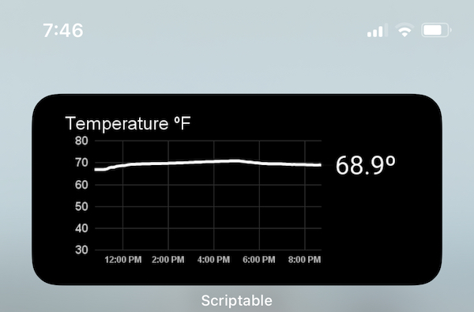

# Wi-Fi Temperature Sensor

## TL;DR

ESP8266 powered temperature sensor recording values to Google Sheets over Wi-Fi. Historical temperature variation visualized in an iPhone widget using Scriptable.

## Final product

Our refrigerator was acting suspicious. In order to monitor its effectiveness, I built and coded a sensor that would record the temperature every minute and store the data in a Google Sheet.

I then looked into how I could monitor the data from an iOS homescreen widget and figured out a fast and hacky way to do it using the [Scriptable app](https://scriptable.app) and Google Sheet's ability to publish a live URL of a chart.

Here's how the final project turned out...

**iOS homescreen widget:**

(Don't worry, this screenshot is from later use monitoring our bedroom temperature, not our fridge 😉)


**Wifi temperature sensor inside custom 3D printed enclosure:**


## Code overview and setup

- `wifi-temp-arduino.ino` Arduino code runs on the ESP8266, running the temperature sensor and uploading values to a Google Sheet
- `config.h` Config file with credentials for Arduino code (in .gitignore).

```c++
//config.h
#define NETWORK_NAME "<your network name>"
#define NETWORK_PASSWORD "<your network password>"
#define BASE_URL "/macros/s/<your apps script deployment ID>/exec";
```

- `wifi-temp-appsscript.js` Apps script code running on the Google Sheet to serve as an API for inserting data
- `appsscript.json` Config file for Apps script
- `wifi-temp-scriptable.js` Javascript run inside the iOS app, Scriptable, to make a custom homescreen widget. (To get the chart_url, click the 3-dot menu on the chart and select publish)
